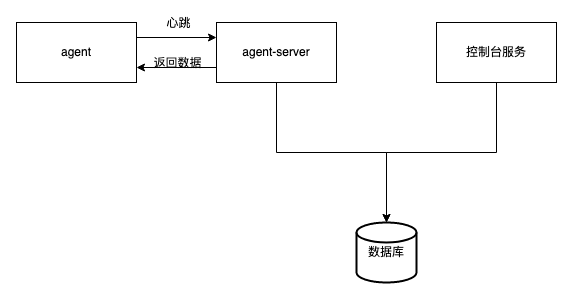

# Takin-Agent-Server
管理Agent的相关功能

## 启动条件
> 列出运行该项目所必须的条件和相关依赖
* 修改配置项
* jvm增加启动参数 -javaagent:path/to/transmittable-thread-local-2.x.y.jar，transmittable-thread-local-2.x.y.jar在编译以后的lib目录下

## 运行说明
> 1.0.0.0版本agent-server与 takin-web 共用一个数据库，增删改操作在 takin-web上完成，agent-server只做查询操作。

## 测试说明
> 如果有测试相关内容需要说明，请填写在这里

## 技术架构
> 1.0.0.0版本架构

## 协作者
> 高效的协作会激发无尽的创造力，将他们的名字记录在这里吧
